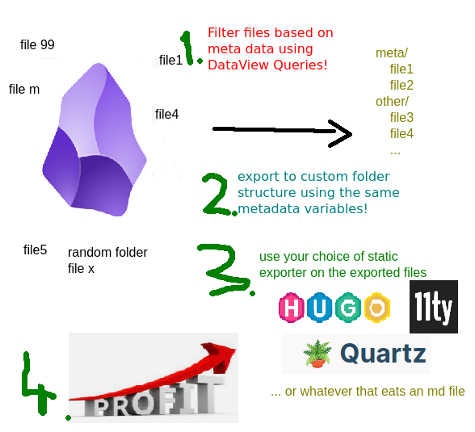

# Bulk Exporter plugin

This is a plugin for Obsidian (https://obsidian.md).

# What it does

Output and restructure your notes based on metadata!

Simply:



So from your random structure like this:

```
- root
  - projects
    - some active project
      - note 1 i want to publish [*] -> tech blog
      - another side topic that belongs here but not ready
    - another active project
      - pacal recepie to publish [*] -> recepies
      - some private note
  - areas
   - photo stream
      - collection of photos [*] -> photo blog
  - archive
    - old recepies
      - soup recepie [*] -> recepies
      - ...
```

Makes something like this:
```
- blogs (output folder anywhere on your drive)
  - recepies
    - pacal-recepie-to-publish.md
    - soup-recepie.md
    - ...
  - tech
    - note-1-i-want-to-publish.md
    - another-archived-tech-blog-entry.md
  - photo-blog
    - collection-of-photos.md
  - ...
```

... so that you can run your custom static site generators on a subset of your notes, like 11ty, Hugo, Jekyll...

Uses the powerful [Obsidian Dataview plugin's](https://github.com/blacksmithgu/obsidian-dataview) language to find the files you want to export.

Shows the latest exported file status in the sidebar.


## Why?

I use static generators (11ty) for my blogs, they are the outlets of my thoughts.

Some of the blog posts I am working on, are part of a bigger topic, and I wanted to keep them around to their respective **PARA project folders** (Building a Second Brain). I needed a folder-independent structure. One source of truth: wherever the file might be, independent from where it is into a structured output format.

### Filter

The plugin uses a full fetched [DataView query](https://blacksmithgu.github.io/obsidian-dataview/queries/data-commands/) without the results type of course, as it's always a table.

#### Examples:

Select all the notes that contain the `tech` tag:

`FROM #tech`

Notes modified last week:

`file.ctime > date(today) - dur(1 week)`

Select all notes that have the `publishDate` metadata key:

`publishDate`

Select all notes that have `publishDate` or `blog` among the metadata keys:

`publishDate OR blog`

### Output File Path and Name

It's a standard JS string literal, that gets the file
metadata and some extras into it's context.

This is great for **grouping** your output files:
you can create conditional sorting parameters, any folder
structures you want.

The following is an example:

If file metadata is like this:
```js
{
  blog: 'diary',
  publishDate: '...'
  title: 'Another day at the office',
  tags: ['running', 'some']
}
```

it will be extended with the following:

```js
{
  created: {
    // moment style object with keys:
    YYYY: '2023',
    MM: '05',
    ...
    date: '2023-05-14',
    time: '17-54'
  },
  modified { ... } // date like above

  fileName: 'Another Day At The Office'

  // if there is a slug property set, uses that, if there is not, falls back to the normalized
  // version of the title property, if again not present, falls back to the normalized version of the file name.
  slug: 'another-day-at-the-office'

  d: function (dateLikeParam){
    // Use it like this: ${d(someDateMetaData).date} // will return the date value parsed and reformatted.
   }
   norm: function(string){
    // Will remove any special characters from the string and replaces spaces and separators with dash (-) so it's url safe.
   }
}
```

#### Examples

Want separate folders for different blogs?

`${blog}/${created.date}-${slug}`

Want to group different years into different folders?

`${blog}/${created.YYYY}/${created.MM}-${created.DD}-${slug}`

Want to keep the original filename and just dump everything in a flat structure?

`${fileName}`

Convert any field to a date:

`${d(date_published).date}`

Use a custom metadata field as formatted date in the output name:

`${blog}/${d(date_published).date}-${slug}`


##### Conditions and ternary operators

For conditional placement of a file, you can use [ternary operators](https://developer.mozilla.org/en-US/docs/Web/JavaScript/Reference/Operators/Conditional_operator)

The following will put all values that have a same `blogname/post/some-entry` meta value into the same folder, except if the file has an `index` key, then it will go to `blogname/indexslug`:

`${blog}/${index?'':'posts/'}${slug}`


## Manually installing the plugin

- Copy over `main.js`, `styles.css`, `manifest.json` to your vault `VaultFolder/.obsidian/plugins/obsidian-bulk-exporter/`.
- Or just simlink it with `ln -s /path/to/your/dev/folder/ /path/to/your/vault/.obsidian/plugins/obsidian-bulk-exporter/`

### Development

1. Check out the code base anywhere (or directly into your `.obsidian/plugins/` folder)
2. You can link that folder into your vault's `.obsidian/plugins/obsidian-bulk-export` folder
3. run `pnpm run dev`.
4. recommended the [hot-reload plugin](https://github.com/pjeby/hot-reload) for dev (this way when you modify anything it'll get auto re-loaded within Obsidian)

### Bugs and Feature requests

Open an [Issue on github](https://github.com/symunona/obsidian-bulk-exporter/issues), or add a PR!

### Thanks

Thanks to [jspaint.app](https://jspaint.app/) for this amazing service.

And of course shout out for the Obsidian people for this amazing tool!
