# The link and attachment replacement pipeline

How a note travels from a Dataview query row to a file on disk, and what happens to
every link and attachment on the way.

This is a map for reading the code, not a spec.

**About the diagrams.** Node labels are deliberately plain - letters, digits, spaces,
hyphens, commas, full stops, nothing else - so they render in every mermaid build,
including the older ones embedded in editor preview panes. The `file.ts:line`
references that make a box worth clicking live in the small table under each diagram
instead. Diagrams are kept small for the same reason: a huge graph is both unreadable
and the thing GitHub silently gives up on.

Files involved:

| file | job |
| --- | --- |
| `src/export/exporter.ts` | finds the files, owns the per-file loop and the error boundary |
| `src/export/collect-assets.ts` | orchestrates one file: parse, then the replacement passes |
| `src/export/get-links-and-attachments.ts` | parsing and classification - the only place links are *read* |
| `src/export/front-matter.ts` | locating and rewriting one YAML value without reserialising the note |
| `src/export/replace-local-links.ts` | the link decision tree and the actual string surgery |
| `src/export/get-markdown-attachments.ts` | copying assets out and writing the new paths back |
| `src/utils/replace-all.ts` | `replaceAll` - literal global replace, used by every write-back |
| `src/utils/log.ts` | the log pane, and the buffer that lets it be written to before it exists |

---

## 1. Finding the files

The query side: what gets exported at all.

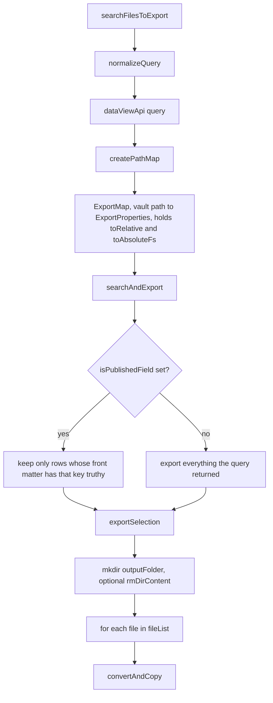

| node | source |
| --- | --- |
| `Q` | `src/export/exporter.ts:151` |
| `NQ` | `src/utils/normalize-query.ts` |
| `DV` | `src/export/exporter.ts:160` |
| `PM` | `src/utils/indexing/create-path-map.ts:103` |
| `SEL` | `src/export/exporter.ts:191` |
| `PUB` | `src/export/exporter.ts:196` |
| `EXP` | `src/export/exporter.ts:256` |
| `PREP` | `src/export/exporter.ts:268` |
| `LOOP` | `src/export/exporter.ts:282` |
| `CAC` | `src/export/exporter.ts:455` |

Then one file, end to end.

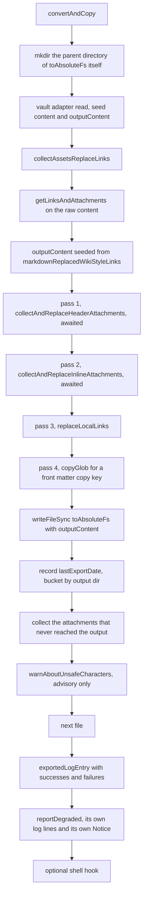

| node | source |
| --- | --- |
| `CAC` | `src/export/exporter.ts:455` |
| `DIR` | `src/export/exporter.ts:468` |
| `READ` | `src/export/exporter.ts:478` |
| `COLL` | `src/export/collect-assets.ts:21` |
| `P0` | `src/export/collect-assets.ts:27` |
| `SEED` | `src/export/collect-assets.ts:33` |
| `P1` | `src/export/collect-assets.ts:40` |
| `P2` | `src/export/collect-assets.ts:41` |
| `P3` | `src/export/collect-assets.ts:43` |
| `P4` | `src/export/collect-assets.ts:54` |
| `WRITE` | `src/export/exporter.ts:486` |
| `STAMP` | `src/export/exporter.ts:301` |
| `DEG` | `src/export/exporter.ts:308`, `:360` |
| `ADV` | `src/export/exporter.ts:318`, `:431` |
| `LOG` | `src/export/export-log.ts` |
| `RD` | `src/export/exporter.ts:327`, `:383` |
| `SH` | `src/export/exporter.ts:336` |

Three things are worth pinning down before reading the rest:

- **`outputContent` is the single mutable buffer.** It is seeded once, at
  `collect-assets.ts:33`, from `markdownReplacedWikiStyleLinks` - the note *after* every
  `[[wiki link]]` in the prose has been rewritten into `[text](wikilink://encoded)` form.
  Every later pass does a literal find-and-replace against that buffer. Nothing
  re-parses.
- **The passes are ordered and they share the buffer.** Header attachments, then inline
  attachments, then links. Each pass reconstructs the string it expects to find from the
  `AttachmentLink` record produced during parsing. If the reconstruction does not match
  the buffer byte for byte, the replace matches nothing and returns the buffer unchanged -
  silently.
- **Parsing reads `content`, writing targets `outputContent`.** They differ by exactly
  one transform: `replaceDoubleBracketLinks`. Keeping that the only difference is what
  makes the literal replaces work at all.

- **`DIR` derives the directory from the file being written**, not from the grouping key.
  Deriving it from `toRelativeToExportDirRoot` made "no group" and "the export root" the
  same thing, so an output format naming a folder never created that folder and every
  write died with `ENOENT`
  ([#18](https://github.com/symunona/obsidian-bulk-exporter/issues/18)).

---

## 2. Link classification

How a raw `[[...]]` or `` becomes one of six buckets, and where the encode/decode
round trip happens.

### 2a. The encode half

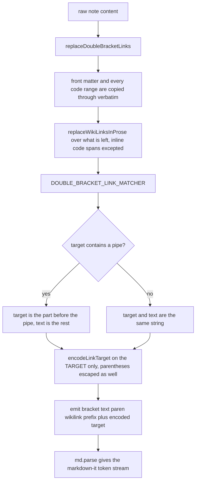

| node | source |
| --- | --- |
| `RDB` | `src/export/get-links-and-attachments.ts:146` |
| `SKIP` | `findCodeRanges`, `src/export/get-links-and-attachments.ts:173` |
| `PROSE` | `src/export/get-links-and-attachments.ts:200` |
| `M` | `src/export/get-links-and-attachments.ts:5` |
| `SPLIT`, `ALIAS`, `SAME`, `FORM` | `toStandardLinks`, `src/export/get-links-and-attachments.ts:212` |
| `ENCC` | `src/export/get-links-and-attachments.ts:237` |
| `MDP` | `src/export/get-links-and-attachments.ts:106` |

`SKIP` is two separate exclusions and both were bugs once. Code: a note documenting
`[[...]]` syntax showed it inside a fence, the fence got rewritten, markdown-it then
correctly refused to linkify code, so no replacement pass ever visited it and a raw
`wikilink://` reached the exported file. Front matter: it is YAML, not markdown, so
`banner: "[[my-banner.png]]"` became a markdown link before `extractHeaderAttachments`
ever saw it.

`ENCC` escapes `(` and `)`, which `encodeURIComponent` leaves alone even though they are
exactly what delimits a markdown link destination. Unescaped, `[[foo (bar]]` produced no
link token at all, and `[[foo)bar]]` had its href cut short at the `)`, so the write-back
needle matched a *prefix* of the real text and corrupted the output.

### 2b. Classifying a body link

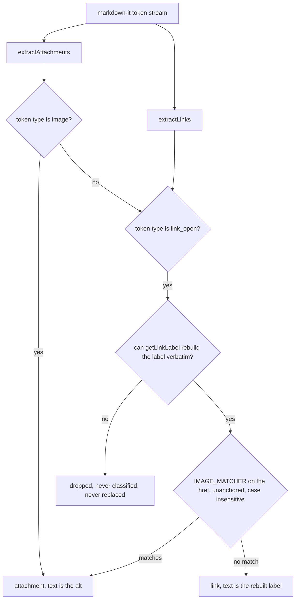

| node | source |
| --- | --- |
| `EA` | `src/export/get-links-and-attachments.ts:337` |
| `EL` | `src/export/get-links-and-attachments.ts:365` |
| `LBL` | `getLinkLabel`, `src/export/get-links-and-attachments.ts:302` |
| `IM` | `IMAGE_MATCHER`, `src/export/get-links-and-attachments.ts:45` |
| `ATT`, `LNK` | `toBodyLink`, `src/export/get-links-and-attachments.ts:324` |

`LBL` used to be "is the very next token a non-empty text token", which lost every link
whose label carried formatting: `[[note|*fancy*]]` puts `em_open` there, so the link
landed in no bucket at all, and `[my *cool* post](other.md)` kept only `my ` - a needle
that does not occur in the document. The label is now reassembled from every token up to
`link_close`, using each token's own `markup`, so it comes back byte for byte. A label
built from a token type that cannot be written back out verbatim still returns `null` and
the link is still skipped: a needle that cannot match must not be guessed at.

### 2c. Classifying a front matter value

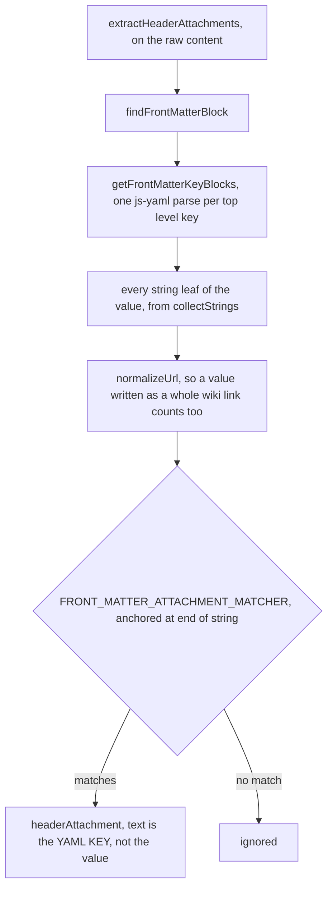

| node | source |
| --- | --- |
| `FM` | `src/export/get-links-and-attachments.ts:261` |
| `FMB` | `src/export/front-matter.ts:91` |
| `FMK` | `src/export/front-matter.ts:104` |
| `FMV` | `collectStrings`, `src/export/front-matter.ts:262` |
| `NRM` | `src/export/get-links-and-attachments.ts:461` |
| `FMM` | `src/export/get-links-and-attachments.ts:52` |

`originalPath` is the value **exactly as the document spells it**, brackets and quotes
and capitals included, because that is the needle the front matter write-back searches
for. Classifying by what the value *points at* is what makes the Banners convention
(`banner: "[[my-banner.png]]"`) work without turning the YAML into a markdown link
([#19](https://github.com/symunona/obsidian-bulk-exporter/issues/19)).

### 2d. The decode half

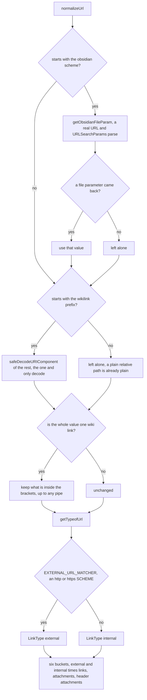

| node | source |
| --- | --- |
| `NORM` | `src/export/get-links-and-attachments.ts:461` |
| `FP` | `src/export/get-links-and-attachments.ts:429` |
| `D2` | `safeDecodeURIComponent`, `src/export/get-links-and-attachments.ts:400` |
| `WW`, `STRIP` | `WHOLE_WIKI_LINK_MATCHER`, `src/export/get-links-and-attachments.ts:12` |
| `TYPE` | `src/export/get-links-and-attachments.ts:484` |
| `HTTP` | `EXTERNAL_URL_MATCHER`, `src/export/get-links-and-attachments.ts:23` |
| `BUCK` | `src/export/get-links-and-attachments.ts:110` |

`FP` reads an Obsidian uri as a url, because that is what it is. Hunting for the literal
text `file=` ended the file name at the end of the whole string, and matched the `file=`
sitting inside *another* parameter's name. `new URL()` throws on input it cannot parse,
so it is guarded the same way `safeDecodeURIComponent` is: an unreadable link is handed
back untouched rather than taking the export down.

`HTTP` tests for a **scheme**. `startsWith('http')` matched a prefix instead, so a note
actually called `http-server-setup` was classed external, dropped from `internalLinks`,
never resolved, and left in the output as a raw `wikilink://` url.

### The one-decode invariant

Both fields of an `AttachmentLink` exist so that this rule can hold:

| field | representation | who consumes it |
| --- | --- | --- |
| `originalPath` | **exactly the text in `outputContent`** - still percent-encoded for a wiki link, still `wikilink://`-prefixed | every write-back, as the needle to search for |
| `normalizedOriginalPath` | **decoded exactly once**, prefix stripped | every vault lookup (`getFirstLinkpathDest`) and every warning |

> **Invariant: a wiki link target is encoded once by `encodeLinkTarget`
> (`get-links-and-attachments.ts:237`) and decoded once by `normalizeUrl`
> (`:470`). Nothing else may encode or decode it.**

That is the invariant issue [#17](https://github.com/symunona/obsidian-bulk-exporter/issues/17)
broke. `replaceLocalLink` called `decodeURIComponent` a second time on
`normalizedOriginalPath`, which had already been decoded. Two consequences, both real: a
literal `%` in a note title (`[[100% sure]]`) is not a valid escape sequence, so the
second decode threw `URIError: URI malformed` and took the whole export down with it; and
a title that merely *looked* encoded (`[[a %20 b]]`) survived the first decode intact and
got quietly mangled by the second. The second decode is gone
(`replace-local-links.ts:62`), and `safeDecodeURIComponent` remains as the belt to that
braces - it catches `URIError` only, warns, and hands the value back untouched.

The mirror image of that bug was [#19](https://github.com/symunona/obsidian-bulk-exporter/issues/19)
in `extractHeaderAttachments`: the value was matched against a `toLocaleLowerCase()` copy
of itself and a slice **of that copy** was kept as `originalPath`. Nothing in the real
document ever matched the lowercased text again, so an image with a capital letter in its
name was copied out but never re-linked. The value now comes out of `js-yaml` verbatim,
and the case-insensitivity Obsidian needs lives in the *matcher* instead
(`get-links-and-attachments.ts:52`).

The same reasoning explains `get-markdown-attachments.ts:261`: the exported asset name
comes from `asset.path` - the file Obsidian actually resolved - not from the text of the
link. Obsidian resolves case-insensitively, so `photo.jpg` in the front matter and
`Photo.jpg` in the body are one file; naming the copy after the link would emit it twice.

---

## 3. The link replacement decision tree

`replaceLocalLink` decides *what* a link should become; `replaceLinks` / `removeLinks`
decide *how it is written*. Only internal links reach here - `collect-assets.ts:43`
passes `internalLinks` only.

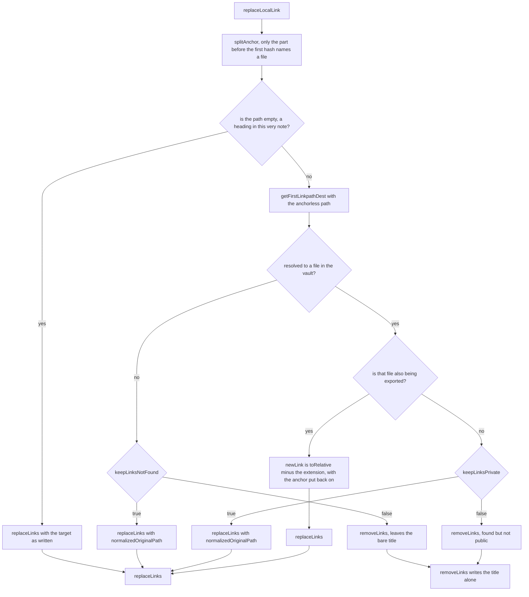

| node | source |
| --- | --- |
| `IN` | `src/export/replace-local-links.ts:40` |
| `SPL` | `splitAnchor`, `src/export/replace-local-links.ts:147` |
| `SELF` | `src/export/replace-local-links.ts:56` |
| `RES` | `src/export/replace-local-links.ts:68` |
| `KLNF` | `src/export/replace-local-links.ts:74` |
| `INMAP` | `src/export/replace-local-links.ts:92` |
| `NEW` | `src/export/replace-local-links.ts:98` |
| `KLP` | `src/export/replace-local-links.ts:106` |
| `RMF` | `removeLinks`, `src/export/replace-local-links.ts:125` |
| `RLF` | `replaceLinks`, `src/export/replace-local-links.ts:181` |

`SPL` and `SELF` are issue
[#14](https://github.com/symunona/obsidian-bulk-exporter/issues/14). Obsidian does not
allow `#` in a file name, so the first one always starts an anchor - a heading
(`note#Intro`) or a block reference (`note#^abc123`). Handing the whole string to
`getFirstLinkpathDest` looked for a file literally called `note#Intro`, never found one,
and stripped the link with a warning. A target that *starts* with `#` names no file at
all: it points inside the note being exported. The anchor goes back on at
`replace-local-links.ts:102` - the heading it names lives in the exported file just as it
did in the vault one.

`replaceLinks` is the shared exit for inline attachments too
(`get-markdown-attachments.ts:128`), so its branches run for images.

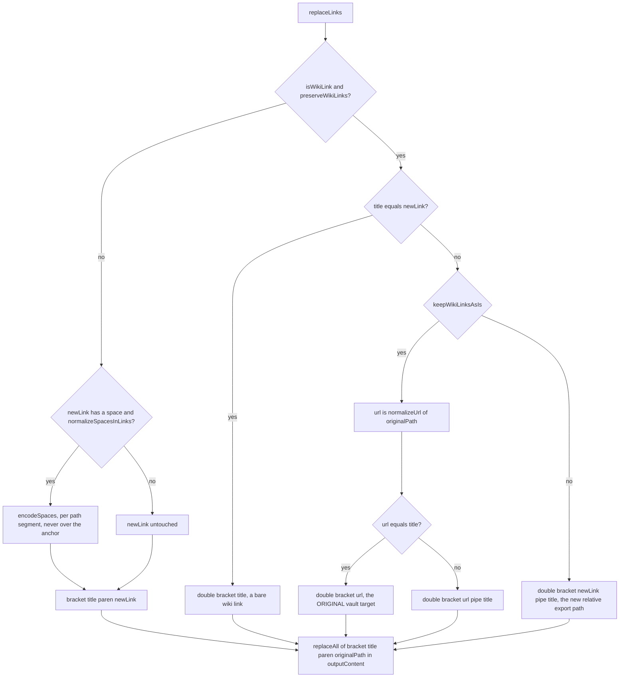

| node | source |
| --- | --- |
| `S` | `src/export/replace-local-links.ts:181` |
| `WIKI` | `src/export/replace-local-links.ts:195` |
| `ENCQ`, `ENC` | `encodeSpaces`, `src/export/replace-local-links.ts:158` |
| `EQ` | `src/export/replace-local-links.ts:196` |
| `KAI` | `src/export/replace-local-links.ts:198` |
| `W4` | `src/export/replace-local-links.ts:208` |
| `MD` | `src/export/replace-local-links.ts:211` |
| `FIN` | `src/export/replace-local-links.ts:214`, `src/utils/replace-all.ts:16` |

**The output syntax is chosen first, and only the `` form is ever encoded.**
Encoding up front - before the branch - let `normalizeSpacesInLinks` reach two places it
has no business in: the `title === newLink` test, which then compared a title against an
encoded copy of itself, and the inside of `[[...]]`, where percent escapes are resolved by
nobody. `[[My Note]]` came out as `[[out/My%20Note|My Note]]`, which neither Obsidian nor
Quartz can follow. `encodeSpaces` also never runs over the anchor: encoding the `#` would
fold a heading reference back into the file name.

Settings, and what each one actually selects:

| setting | default | effect |
| --- | --- | --- |
| `keepLinksNotFound` | `false` | target does not exist in the vault at all: `false` strips the link to plain text, `true` keeps it pointing at the original name. Since the attachment degradation fix, this governs missing *attachments* too |
| `keepLinksPrivate` | `false` | target exists but is not in this export: `false` strips it (that is the "do not leak private notes" switch), `true` keeps it |
| `preserveWikiLinks` | `true` | emit `[[...]]` rather than `` for anything that *came in* as a wiki link. Exists because file names with spaces break non-Obsidian markdown parsers - see issue #3 |
| `keepWikiLinksAsIs` | `false` | inside `preserveWikiLinks`: point at the original vault target instead of the computed export path. For consumers like Quartz that resolve wiki links themselves |
| `normalizeSpacesInLinks` | `false` | percent-encode each path segment of the new link. Applies to the `` form only |
| `keepOriginalAttachmentFileNames` | `false` | asset file names: `false` appends an md5 of the source path, `true` keeps the name as-is |

### The attachment side

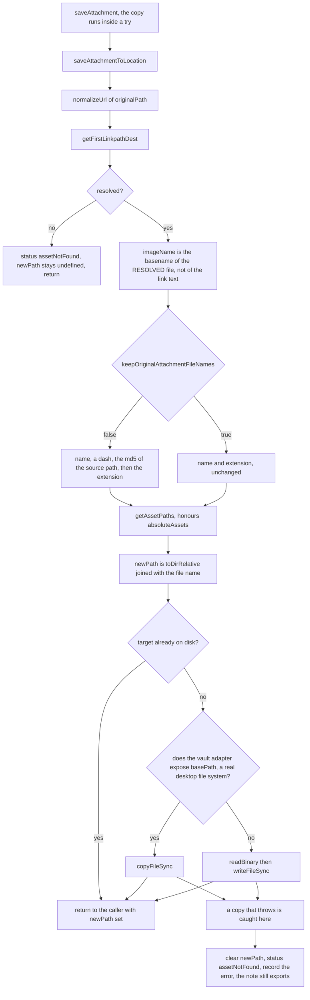

| node | source |
| --- | --- |
| `A`, `THREW`, `CLR` | `saveAttachment`, `src/export/get-markdown-attachments.ts:193` |
| `B` | `src/export/get-markdown-attachments.ts:236` |
| `R` | `src/export/get-markdown-attachments.ts:247` |
| `NF` | `src/export/get-markdown-attachments.ts:249` |
| `NAME` | `src/export/get-markdown-attachments.ts:261` |
| `HASH`, `H1`, `H2` | `src/export/get-markdown-attachments.ts:269` |
| `PATHS` | `src/utils/indexing/asset-and-link-paths.ts:5` |
| `SET` | `src/export/get-markdown-attachments.ts:278` |
| `EX` | `src/export/get-markdown-attachments.ts:290` |
| `ADAPT` | `src/export/get-markdown-attachments.ts:296` |
| `CP` | `src/export/get-markdown-attachments.ts:303` |
| `RB` | `src/export/get-markdown-attachments.ts:305` |

`CLR` clears `newPath` because `saveAttachmentToLocation` assigns it *before* the copy it
then fails at. Left set, the collectors would rewrite the link to point at a file that was
never written - the one outcome worse than a broken link, since it looks fine right up
until the page is loaded. The status is `assetNotFound` and not `error` on purpose: from
the exported site's side there is no difference, and `error` already marks the link that a
file is about to be failed over.

Then the write-back, once the save has resolved:

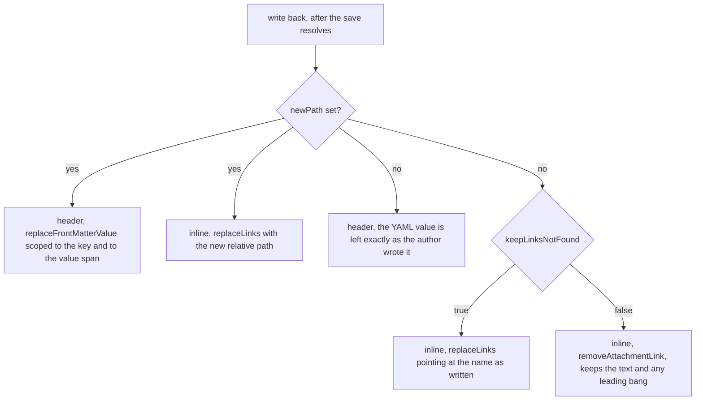

| node | source |
| --- | --- |
| `W` | `src/export/get-markdown-attachments.ts:80`, `:115` |
| `HDR` | `src/export/get-markdown-attachments.ts:100`, `src/export/front-matter.ts:287` |
| `INL` | `src/export/get-markdown-attachments.ts:128` |
| `KLNF` | `src/export/get-markdown-attachments.ts:152` |
| `RMV` | `removeAttachmentLink`, `src/export/get-markdown-attachments.ts:224` |

Both collectors are `for ... of` plus `await`. They used to be `forEach` plus
fire-and-forget, which only ever worked because `saveAttachmentToLocation` happened to
reach the `newPath` assignment before its first `await` - one `await` added above that
line and every rewrite below would have silently stopped happening. It also meant a
rejected save became an unhandled rejection nobody sees.

The `HAS -- no` branch is the missing-attachment fix. It used to fall through to the same
`replaceLinks` call with `''` for the new path - guarded on the header side, not on the
inline one - so a broken embed was rewritten into a differently broken one:
``, or `![[|missing.png]]` with `preserveWikiLinks` on. An empty link
target is not a decision, it is state read out of the branch that was supposed to set it.
An attachment that is not in the output is the same situation as a note link that resolves
to nothing, so it now gets the same answer from the same setting.

Front matter write-back is deliberately narrow. `replaceFrontMatterValue`
(`front-matter.ts:287`) re-locates the block, finds the one top level key whose parsed
values contain the old value, and then splices at the value's **recorded source span**
(`FrontMatterValueSpan`, `front-matter.ts:80`) rather than searching for it. The note is
never reserialised - quoting, indentation, comments and key order survive byte for byte,
and the replacement is written back in the quoting style the scalar already had. That is
why `AttachmentLink.text` holds the **YAML key** for a header attachment rather than a
display title: it is the write-back's scope.

Scoping to the key alone was not enough, and that was two bugs at once. `oldValue` is what
YAML parsed; `block.text` is what the user wrote; a literal replace between the two
matched too much and too little. Too much: `hero.png` inside

    images:
      - hero.png
      - thumbs/hero.png

also rewrote the substring in the second entry, and the second attachment then found
nothing left to change. Too little: `thumb: 'it''s.png'` parses to `it's.png`, which does
not occur anywhere in the raw text, so the asset was copied and the link was never
updated. Recording the span at parse time answers both.

---

## 4. Error containment

Where a throw can happen and which guard stops it. The per-file boundary is the important
one: one unexportable note must not take the batch with it (issue
[#17](https://github.com/symunona/obsidian-bulk-exporter/issues/17)).

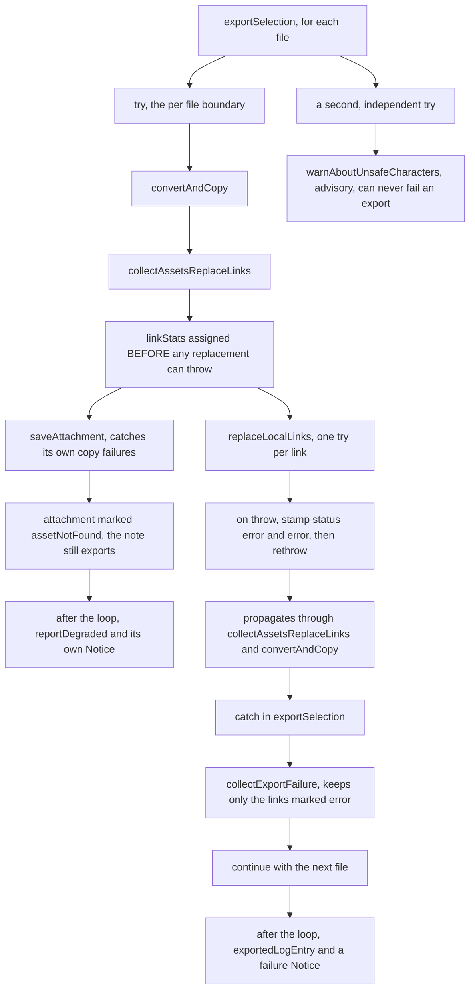

| node | source |
| --- | --- |
| `LOOP` | `src/export/exporter.ts:282` |
| `TRY` | `src/export/exporter.ts:290` |
| `CC` | `src/export/exporter.ts:455` |
| `CA` | `src/export/collect-assets.ts:21` |
| `STATS` | `src/export/collect-assets.ts:32` |
| `SAVE`, `DGR` | `src/export/get-markdown-attachments.ts:193` |
| `RLL` | `src/export/replace-local-links.ts:18` |
| `ANN` | `src/export/replace-local-links.ts:33` |
| `CATCH` | `src/export/exporter.ts:311` |
| `CEF` | `src/export/exporter.ts:407` |
| `TRY2`, `UNSAFE` | `src/export/exporter.ts:318`, `:431` |
| `AFTER` | `src/export/exporter.ts:325` |
| `AFTER2` | `src/export/exporter.ts:327`, `:383` |

The design in one sentence: **`replaceLocalLinks` annotates and rethrows,
`exportSelection` decides.** The rethrow at `replace-local-links.ts:35` looks redundant
but is not - it is what turns an anonymous stack trace into "this file failed *because of
this link*". The annotation survives because `linkStats` is assigned up front at
`collect-assets.ts:32`, before anything can throw, so the failure path always has a list
to filter.

There are three boundaries, and they are deliberately at different depths:

- `try` at `exporter.ts:290` wraps the export of one file. A throw here loses that file
  and records an `ExportFailure`. Everything below it - the link rewrite, the `.md` write
  itself - throws through to here, where a genuine bug belongs.
- `try` at `exporter.ts:318` wraps `warnAboutUnsafeCharacters`. That code only advises
  about a file that has already been written, so it must not be able to fail the export it
  is advising on.
- `try` at `get-markdown-attachments.ts:199` wraps **only the attachment copy**. For a
  static site export the trade is plain: one dead image is a hole in a page, a skipped
  `.md` is a missing page. So the failure is recorded on the attachment and the note goes
  out without it.

A file that exports *with* a hole in it is a partial success, and it is reported
separately (`reportDegraded`, `exporter.ts:383`) rather than folded into the failure
count. Those two numbers answer different questions - "re-run it" versus "go fix that
asset" - and quietly merging them would make the one number a user reads mean two things.

`collectExportFailure` (`exporter.ts:407`) also handles a non-`Error` throw
(`String(thrown)`), which matters because a rejected vault promise is not always an
`Error`.

One boundary sits outside the export entirely: `log()` / `warn()` / `error()`
(`utils/log.ts:60`). The pane exists only after `BulkExporterView.onOpen` has run, and
plenty of code runs before that - the `bulk-export` palette command exports first and
opens the view afterwards. Writing to it used to `throw`, and since both call sites are
fire-and-forget the throw became an unhandled rejection: the export never happened, the
status icons were never applied, and the user was told nothing at all. Entries logged
before there is anywhere to put them are now buffered (capped at 500, oldest dropped) and
replayed by `setLogOutput` (`utils/log.ts:107`) the moment a target registers.

---

## Invariants worth keeping

Each of these is a bug that was paid for once. Breaking one costs it again.

- **One encode, one decode.** `encodeLinkTarget` encodes; `normalizeUrl` decodes. Nothing
  else touches the escaping of a wiki link target.
- **The needle is the document, not a transform of it.** `originalPath` is always the
  exact text sitting in `outputContent`. Never derive it from a lowercased, decoded or
  re-serialised copy.
- **Code and front matter are not prose.** `replaceDoubleBracketLinks` rewrites the body
  only, and skips fences, indented code and inline code spans.
- **Output syntax first, encoding second.** Only `` is ever percent-encoded, and
  never across the anchor.
- **Split the anchor before the lookup.** `getFirstLinkpathDest` is given a file name,
  never a file name with a `#` in it.
- **`mkdir` the parent of the file being written**, derived from `toAbsoluteFs`, not from
  the grouping key.
- **A front matter value is located by its source span**, not by searching for the parsed
  text inside the raw text.
- **`replaceAll` is literal in both directions.** The needle is regex-escaped and the
  replacement is passed as a *function*, so `$&`, `` $` ``, `$'` and `$$` in a note title
  or an asset name are never expanded (`utils/replace-all.ts:17`).
- **Error containment is per file and per attachment**, and the advisory pass is outside
  both.
- **A missing target is a decision, never an empty string.** `keepLinksNotFound` answers
  it, for note links and attachments alike.

---

## Known sharp edges

Verified against the current source. Each is reproducible from the input given.

**The write-back is a literal string match, and a miss is silent.** Every pass
reconstructs `[text](originalPath)` and hands it to `replaceAll`. If the reconstruction
is off by one byte, the replace matches nothing and returns the buffer unchanged, with no
error anywhere. This is the failure mode behind most of the fixed bugs above, and it is
still the shape of the code.

**A link label markdown-it cannot hand back verbatim is skipped entirely**
(`get-links-and-attachments.ts:302`, `:31`). `getLinkLabel` can rebuild text, inline
code, soft breaks and emphasis delimiters. A label holding a nested image or raw HTML
returns `null`, so the link lands in no bucket and its raw `wikilink://` form reaches the
exported file. Deliberate - a needle that cannot match must not be guessed at - but it is
still a link that does not get rewritten.

    Input:  [[note| caption]]
    Output: [ caption](wikilink://note)

**`IMAGE_MATCHER` is unanchored** (`get-links-and-attachments.ts:45`). Any href
*containing* an attachment extension anywhere is classified as an attachment, not a link.

    [see the docs](https://example.com/a.png/guide)  ->  treated as an attachment

**`findCodeRanges` knows fences and indented code, not raw HTML blocks**
(`get-links-and-attachments.ts:182`). A `[[wiki link]]` inside an `html_block` - a `<pre>`
sample, say - is still rewritten as prose.

**A front matter value whose source span cannot be pinned down falls back to a literal
replace** (`front-matter.ts:308`). The scan is deliberately conservative: it claims a span
only when the whole scalar sits on one line and YAML reads that slice back as a string. A
flow sequence (`images: [a.png, b.png]`), a block scalar (`thumb: >-`) or a quoted value
running over a line break is left unclaimed, and for exactly those shapes both of the old
failure modes - matching too much, matching too little - are still reachable.

**One front matter key that is not valid YAML on its own costs that key**
(`front-matter.ts:130`). `title: Bad: line` is parsed per block, so it is skipped with a
console warning and every other key survives - but any attachment under that key is
invisible to the exporter.

**An existing file at the target path skips the copy**
(`get-markdown-attachments.ts:290`). With `keepOriginalAttachmentFileNames` on, two
different vault assets that share a basename collapse onto one exported file and the first
one silently wins. The md5 suffix in the default naming is what prevents this.

**Only attachment values are read out of the front matter.** A YAML value that is a wiki
link to a *note* - `related: "[[Some Note]]"` - is neither classified nor rewritten: the
anchored matcher at `get-links-and-attachments.ts:52` only accepts attachment extensions.
`WHOLE_WIKI_LINK_MATCHER` is anchored too, so a wiki link embedded in a longer YAML string
is not recognised either.
