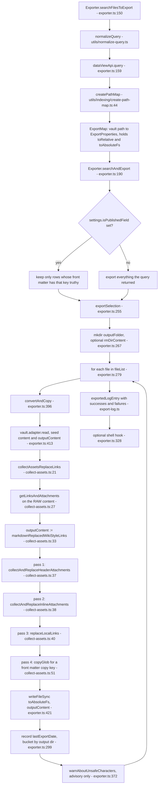
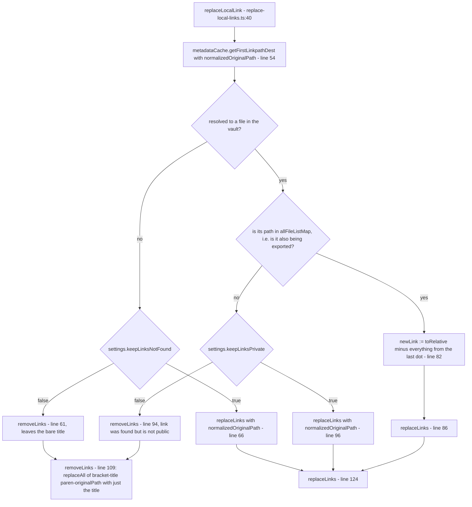
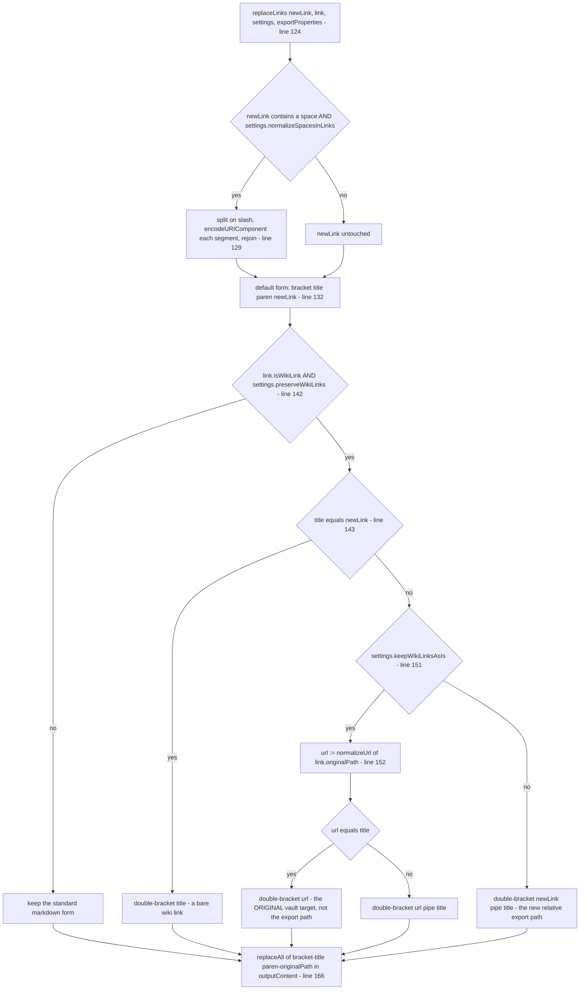
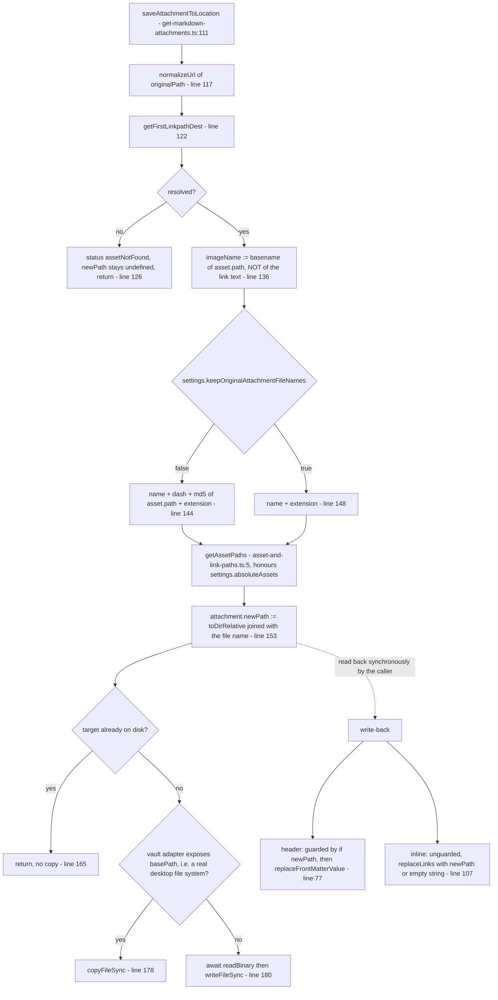
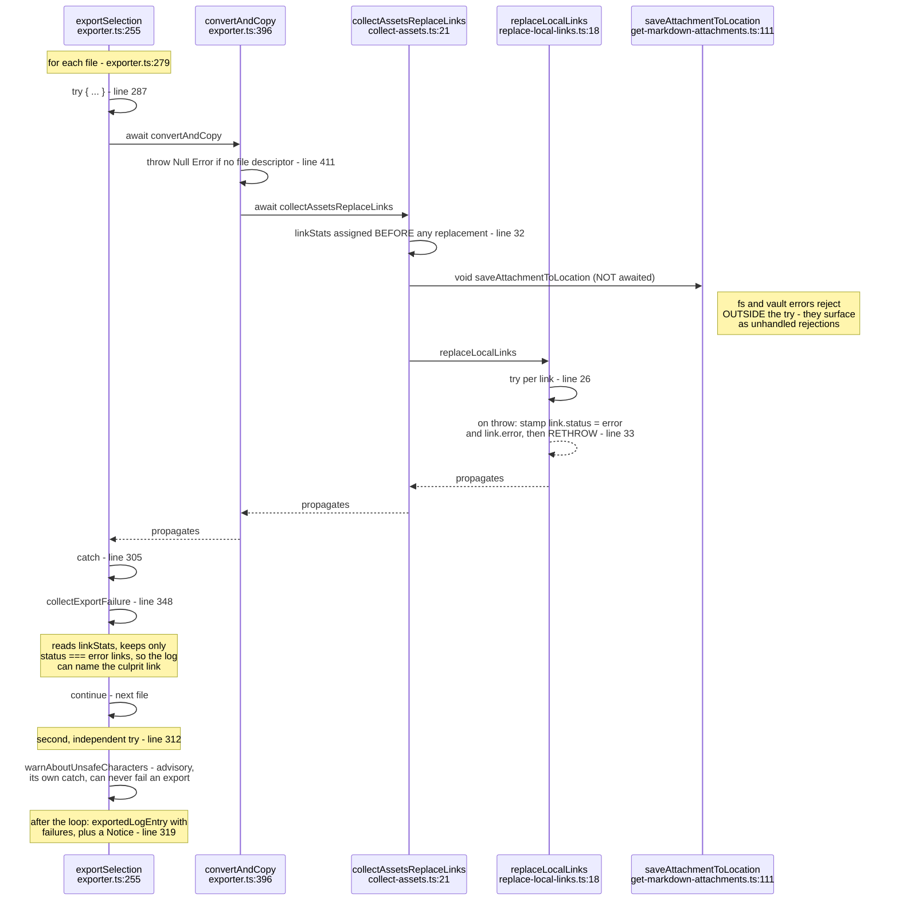

# The link and attachment replacement pipeline

How a note travels from a Dataview query row to a file on disk, and what happens to
every link and attachment on the way.

This is a map for reading the code, not a spec. Every node is labelled with the real
function and a `file.ts:line` reference, so a diagram box can be turned into a jump.

Files involved:

| file | job |
| --- | --- |
| `src/export/exporter.ts` | finds the files, owns the per-file loop and the error boundary |
| `src/export/collect-assets.ts` | orchestrates one file: parse, then three replacement passes |
| `src/export/get-links-and-attachments.ts` | parsing and classification - the only place links are *read* |
| `src/export/front-matter.ts` | locating and rewriting one YAML key without reserialising the note |
| `src/export/replace-local-links.ts` | the link decision tree and the actual string surgery |
| `src/export/get-markdown-attachments.ts` | copying assets out and writing the new paths back |
| `src/utils/replace-all.ts` | `replaceAll` - literal global replace, used by every write-back |

---

## 1. Pipeline overview

One note, end to end.

Three things are worth pinning down before reading the rest:

- **`outputContent` is the single mutable buffer.** It is seeded once, at
  `collect-assets.ts:33`, from `markdownReplacedWikiStyleLinks` - the note *after* every
  `[[wiki link]]` has been rewritten into `[text](wikilink://encoded)` form. Every later
  pass does a literal find-and-replace against that buffer. Nothing re-parses.
- **The passes are ordered and they share the buffer.** Header attachments, then inline
  attachments, then links. Each pass reconstructs the string it expects to find from the
  `AttachmentLink` record produced during parsing. If the reconstruction does not match
  the buffer byte for byte, the replace matches nothing and returns the buffer unchanged -
  silently.
- **Parsing reads `content`, writing targets `outputContent`.** They differ by exactly
  one transform: `replaceDoubleBracketLinks`. Keeping that the only difference is what
  makes the literal replaces work at all.

---

## 2. Link classification

How a raw `[[...]]` or `` becomes one of six buckets, and where the encode/decode
round trip happens.

```mermaid
flowchart TD
    RAW["raw note content"]
    RAW --> RDB["replaceDoubleBracketLinks - get-links-and-attachments.ts:102"]

    subgraph ENC ["the ENCODE half"]
        RDB --> M["DOUBLE_BRACKET_LINK_MATCHER - line 6"]
        M --> SPLIT{"target contains a pipe?"}
        SPLIT -- yes --> ALIAS["target := part before pipe, text := the rest - line 110"]
        SPLIT -- no --> SAME["target and text are the same string"]
        ALIAS --> ENCC
        SAME --> ENCC
        ENCC["encodeURIComponent on the TARGET ONLY - line 114"]
        ENCC --> WRITEFORM["emit: bracket text paren wikilink-colon-slash-slash + encoded target"]
        WRITEFORM --> RALL["replaceAll over the whole document - line 115"]
    end

    RALL --> MDP["md.parse - line 78"]
    MDP --> TOKS["markdown-it token stream"]

    TOKS --> EA["extractAttachments - line 158"]
    TOKS --> EL["extractLinks - line 205"]
    RDB --> EHA["extractHeaderAttachments on the TRANSFORMED text - line 81"]

    EA --> ISIMG{"token type is image?"}
    ISIMG -- yes --> ATT["attachment, text := alt"]
    ISIMG -- no --> LO{"token is link_open AND the very next token is a non-empty text token?"}
    LO -- no --> DROP["dropped: never classified, never replaced"]
    LO -- yes --> IM{"IMAGE_MATCHER on the href - line 17, unanchored, case insensitive"}
    IM -- matches --> ATT
    IM -- no match --> LNK["link, text := that text token content"]

    EHA --> FMB["findFrontMatterBlock - front-matter.ts:55"]
    FMB --> FMK["getFrontMatterKeyBlocks, one js-yaml parse per top level key - front-matter.ts:68"]
    FMK --> FMV["every string leaf of the value - collectStrings, front-matter.ts:113"]
    FMV --> FMM{"FRONT_MATTER_ATTACHMENT_MATCHER - line 24, ANCHORED at end of string"}
    FMM -- matches --> HATT["headerAttachment, text := the YAML KEY, not the value"]
    FMM -- no match --> IGN["ignored"]

    ATT --> NORM
    LNK --> NORM
    HATT --> NORM

    subgraph DEC ["the DECODE half - normalizeUrl, line 267"]
        NORM["normalizeUrl"]
        NORM --> OBS{"starts with obsidian-colon-slash-slash ?"}
        OBS -- yes --> FP{"contains file= ?"}
        FP -- yes --> D1["safeDecodeURIComponent of the part after file= - line 274"]
        FP -- no --> KEEP1["left alone - the guard that stops a blind substring chop"]
        OBS -- no --> WL
        D1 --> WL
        KEEP1 --> WL
        WL{"starts with wikilink-colon-slash-slash ?"}
        WL -- yes --> D2["safeDecodeURIComponent of the part after the prefix - line 279"]
        WL -- no --> KEEP2["left alone - a plain relative path is already plain"]
    end

    D2 --> TYPE
    KEEP2 --> TYPE
    TYPE["getTypeofUrl - line 284"]
    TYPE --> HTTP{"normalized value startsWith the four letters h t t p ?"}
    HTTP -- yes --> EXT["LinkType.external"]
    HTTP -- no --> INT["LinkType.internal"]

    EXT --> BUCK
    INT --> BUCK
    BUCK["six buckets: external/internal x Links / Attachments / HeaderAttachments - line 87"]
```

### The one-decode invariant

Both fields of an `AttachmentLink` exist so that this rule can hold:

| field | representation | who consumes it |
| --- | --- | --- |
| `originalPath` | **exactly the text in `outputContent`** - still percent-encoded for a wiki link, still `wikilink://`-prefixed | every write-back, as the needle to search for |
| `normalizedOriginalPath` | **decoded exactly once**, prefix stripped | every vault lookup (`getFirstLinkpathDest`) and every warning |

> **Invariant: a wiki link target is encoded once by `replaceDoubleBracketLinks`
> (line 114) and decoded once by `normalizeUrl` (line 279). Nothing else may
> encode or decode it.**

That is the invariant issue #17 broke. `replaceLocalLink` used to call
`decodeURIComponent` a second time on `normalizedOriginalPath`, which had already been
decoded. Two consequences, both real:

- a literal `%` in a note title (`[[100% sure]]`) is not a valid escape sequence, so the
  second decode threw `URIError: URI malformed` - and, before the per-file guard existed,
  took the whole export down with it;
- a title that merely *looked* encoded (`[[a %20 b]]`) survived the first decode intact
  and got quietly mangled by the second.

`safeDecodeURIComponent` (line 252) is the belt to that braces: it catches `URIError`
only, warns, and hands the value back untouched. It does **not** make a double decode
correct - it makes it non-fatal.

The mirror image of that bug was issue #19 in `extractHeaderAttachments`: the value was
matched against a `toLocaleLowerCase()` copy of itself and then a slice **of that copy**
was kept as `originalPath`. Nothing in the real document ever matched the lowercased
text again, so an image with a capital letter in its name was copied out but never
re-linked. The fix was to stop deriving the needle from a transformed string: the value
now comes out of `js-yaml` verbatim (`front-matter.ts:113`), and the case-insensitivity
that Obsidian needs lives in the *matcher* (the `i` flag, line 24) instead.

The same reasoning explains `get-markdown-attachments.ts:136`: the exported asset name
comes from `asset.path` - the file Obsidian actually resolved - not from the text of the
link. Obsidian resolves case-insensitively, so `photo.jpg` in the front matter and
`Photo.jpg` in the body are one file; naming the copy after the link would emit it twice.

---

## 3. The link replacement decision tree

`replaceLocalLink` decides *what* a link should become; `replaceLinks` / `removeLinks`
decide *how it is written*. Only the internal links reach here - `collect-assets.ts:40`
passes `internalLinks` only.

`replaceLinks` is also the shared exit for inline attachments
(`get-markdown-attachments.ts:107`), so its branches run for images too:

Settings, and what each one actually selects:

| setting | default | effect |
| --- | --- | --- |
| `keepLinksNotFound` | `false` | target does not exist in the vault at all: `false` strips the link to plain text, `true` keeps it pointing at the original name |
| `keepLinksPrivate` | `false` | target exists but is not in this export: `false` strips it (that is the "do not leak private notes" switch), `true` keeps it |
| `preserveWikiLinks` | `true` | emit `[[...]]` rather than `` for anything that *came in* as a wiki link. Exists because file names with spaces break non-Obsidian markdown parsers - see issue #3 |
| `keepWikiLinksAsIs` | `false` | inside `preserveWikiLinks`: point at the original vault target instead of the computed export path. For consumers like Quartz that resolve wiki links themselves |
| `normalizeSpacesInLinks` | `false` | percent-encode each path segment of the new link |
| `keepOriginalAttachmentFileNames` | `false` | asset file names: `false` appends an md5 of the source path, `true` keeps the name as-is |

The attachment side of the same story:

Note the dotted edge. `saveAttachmentToLocation` is `async` but the caller does not await
it (`line 73`, `line 102`); it reads `attachment.newPath` on the very next statement.
That works only because every statement up to `newPath` assignment (line 153) is
synchronous, so it runs in the first tick before the promise is returned. The first
`await` in the function is at line 180, after the assignment. **Adding an `await`
anywhere above line 153 would silently stop all attachment link rewriting** without
failing a single test.

Front matter write-back is deliberately narrow. `replaceFrontMatterValue`
(`front-matter.ts:132`) re-locates the block, finds the one top level key whose parsed
values contain the old value, and replaces inside that block's raw text only. The note is
never reserialised - quoting, indentation, comments and key order survive byte for byte.
That is why `AttachmentLink.text` holds the **YAML key** for a header attachment rather
than a display title: it is the write-back's scope.

---

## 4. Error containment

Where a throw can happen and which guard stops it. The per-file boundary is the
important one: one unexportable note must not take the batch with it (issue #17).

The design in one sentence: **`replaceLocalLinks` annotates and rethrows, `exportSelection`
decides.** The rethrow at `replace-local-links.ts:35` looks redundant but is not - it is
what turns an anonymous stack trace into "this file failed *because of this link*". The
annotation survives because `linkStats` is assigned up front at `collect-assets.ts:32`,
before anything can throw, so the failure path always has a list to filter.

Two boundaries are deliberately separate:

- `try` at `exporter.ts:287` wraps the export itself. A throw here loses the file and
  records an `ExportFailure`.
- `try` at `exporter.ts:312` wraps `warnAboutUnsafeCharacters`. That code only advises
  about a file that has already been written, so it must not be able to fail the export
  it is advising on.

`collectExportFailure` (`exporter.ts:348`) also handles a non-`Error` throw
(`String(thrown)`), which matters because a rejected vault promise is not always an
`Error`.

One hole is known and left explicit above: the two `void saveAttachmentToLocation` calls
are outside every guard. A failure to copy an asset - a permission error, a full disk -
rejects into the process, not into `ExportFailure`, and the note is still written with a
link pointing at an asset that was never copied.

---

## Known sharp edges

Verified behaviours worth knowing before changing anything here. Each is reproducible
from the input given.

**`replaceDoubleBracketLinks` is not code-block aware.** It is a plain regex over the
whole document (`get-links-and-attachments.ts:103`), so a wiki link shown as an *example*
inside a fence or inline backticks is rewritten too. markdown-it then correctly refuses
to make a link out of code, so no replacement pass ever visits it, and the raw
`wikilink://` form is what gets written to disk.

    Input:  `[[Some Note]]` inside a fenced code block
    Output: [Some Note](wikilink://Some%20Note) inside that code block

**A link is only classified when the token straight after `link_open` is a plain text
token** (`get-links-and-attachments.ts:215`, `:183`). A wiki link whose alias starts with
markdown formatting produces `em_open` there instead, so the link is dropped from every
bucket and never rewritten.

    Input:  [[note|*fancy*]]
    Output: [*fancy*](wikilink://note)

**Unbalanced or bare parentheses in a note name break the round trip.**
`encodeURIComponent` does not escape `(` or `)` (line 114), and markdown-it's link
destination parser treats them structurally.

    Input:  [[foo (bar]]   ->  no link token at all, wikilink:// reaches the output
    Input:  [[foo)bar]]    ->  href truncated to wikilink://foo, and the write-back
                               replaces a prefix of the text: "foo)barbar)"

**`getTypeofUrl` matches a prefix, not a scheme** (line 284): `startsWith('http')`. A note
whose name begins with those four letters is classified `external`, so it never reaches
`replaceLocalLinks`.

    Input:  [[http-server-setup]]
    Output: [http-server-setup](wikilink://http-server-setup)

**A missing attachment still rewrites the link.** The header path is guarded by
`if (attachment.newPath)` (`get-markdown-attachments.ts:77`); the inline path is not
(`:107`) and passes `''` instead.

    Input:  ![[missing.png]], asset not found
    Output:           with preserveWikiLinks off
    Output: ![[|missing.png]]         with preserveWikiLinks on, keepWikiLinksAsIs off

**`normalizeSpacesInLinks` is applied before the output syntax is chosen.** The encoded
value is what the `title === newLink` test at line 143 compares against, and what ends up
inside the double brackets at line 161 - where percent escapes are not resolved.

    [[My Note]] with normalizeSpacesInLinks + preserveWikiLinks
    ->  [[out/My%20Note|My Note]]

**Front matter values are replaced by literal substring within their key block**
(`front-matter.ts:146`). When one value in a list is a suffix of another, the first
replacement also hits the second.

    images:
      - hero.png
      - thumbs/hero.png
    ->  thumbs/assets/hero-HASH.png

Also, `js-yaml` hands back the *parsed* value while the replace runs against the *raw*
text, so a value that YAML escapes (`thumb: 'it''s.png'`) is copied but never re-linked -
the replace matches nothing and returns the document unchanged.

**`replaceAll` does not escape its replacement string** (`utils/replace-all.ts:2`).
`escapeRegExp` protects the needle, but `String.replace` still interprets `$&`, `` $` ``,
`$'` and `$$` in the replacement. `$1` is safe only because the pattern has no capture
groups.
